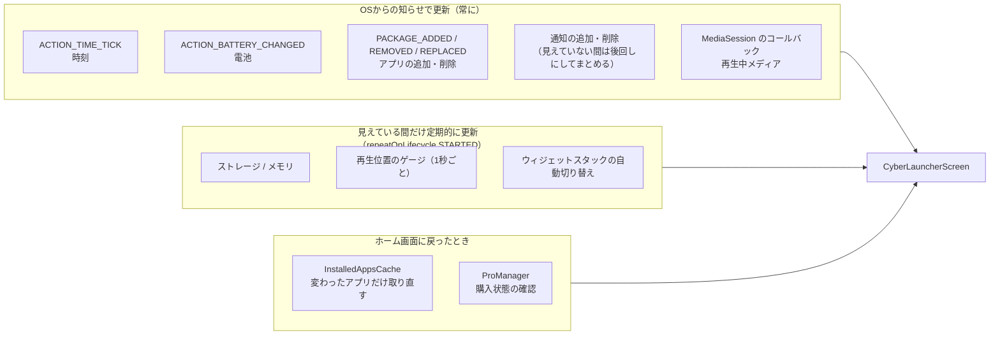
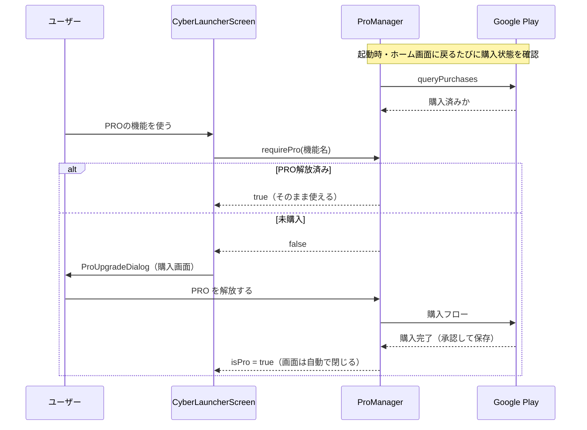

# GridLauncher システム構成図

アプリは1つの Activity（`MainActivity`）の上に、Jetpack Compose の画面（`CyberLauncherScreen`）を
載せた構成。ネットワーク通信は Google Play の課金だけで、それ以外はすべて端末内で完結する。

## 1. 全体の構成

```mermaid
flowchart TB
    subgraph APP["GridLauncher（アプリのプロセス）"]
        direction TB
        MA["MainActivity<br/>ホームボタン・ウィジェット設定の結果を受け取る"]

        subgraph UI["画面（Jetpack Compose）"]
            direction TB
            CLS["CyberLauncherScreen<br/>ホーム画面の本体・状態の持ち主"]
            SEC["セクション<br/>ヘッダー / APP LIST / QUICK ACCESS / DOCK<br/>カレンダー / DEVICE STATUS / NOW PLAYING"]
            WC["WidgetCanvas<br/>ウィジェットの配置・移動・リサイズ・スタック"]
            SHEETS["シート・ダイアログ<br/>ALL APPS / SELECT APP / CUSTOMIZE<br/>オンボーディング / PRO購入画面"]
            DRAG["AppDragAndDrop<br/>アプリのドラッグ＆ドロップ"]
            THEME["テーマ<br/>LocalCyberColors / CyberFont / ThemePresets"]
        end

        subgraph LOGIC["ロジック・状態（util）"]
            direction TB
            CACHE["InstalledAppsCache<br/>アプリ一覧のキャッシュ"]
            APPU["AppUtils / AppSort<br/>アプリ情報・アイコン加工・並べ替え"]
            ICONPACK["IconPackManager<br/>アイコンパックの読み込み"]
            SETTINGS["各種設定<br/>Dock / SlotGrid / WidgetStack<br/>HomeGestures / HeaderTitle など"]
            LAYOUT["WidgetLayoutUtils / WidgetStackUtils<br/>配置の計算"]
            BACKUP["LauncherBackup<br/>設定のJSON書き出し・読み込み"]
            AWH["AppWidgetHostManager<br/>外部ウィジェットのホスト"]
        end

        PRO["ProManager<br/>PROの購入状態"]

        subgraph SVC["常駐するサービス"]
            NL["CyberNotificationListener<br/>通知の件数・再生中メディア"]
            ACC["PowerMenuAccessibilityService<br/>電源メニュー・ジェスチャーの操作"]
        end

        PREFS[("SharedPreferences<br/>cyber_launcher")]
    end

    subgraph OS["Android（OS）"]
        PM["PackageManager<br/>アプリ一覧・変更の通知"]
        NMS["通知 / MediaSession"]
        AWM["AppWidgetManager"]
        SYS["ブロードキャスト<br/>時刻・電池・アプリの追加削除"]
        CP["CalendarContract<br/>UsageStats / ストレージ・メモリ"]
        GA["グローバル操作<br/>電源メニュー・通知パネル・画面オフ"]
        ROLE["RoleManager<br/>デフォルトのホームアプリ"]
    end

    GP["Google Play Billing<br/>（唯一の外部通信）"]

    MA --> CLS
    CLS --> SEC & WC & SHEETS & DRAG
    THEME -.-> UI
    CLS --> CACHE --> APPU --> ICONPACK
    CLS --> SETTINGS & LAYOUT & AWH
    SHEETS --> BACKUP
    SETTINGS & BACKUP --> PREFS
    CLS -- "requirePro()" --> PRO
    PRO --> GP

    CACHE --> PM
    SYS --> CLS
    NL -- "StateFlow" --> CLS
    NMS --> NL
    AWH --> AWM
    SEC --> CP
    CLS --> ACC --> GA
    SHEETS --> ROLE
```

### ホーム画面（`ui/screens`）のファイルの分け方

| ファイル | 中身 |
|---|---|
| `CyberLauncherScreen.kt` | ホーム画面の本体。画面の状態を持ち、各部品・ダイアログを組み立てる |
| `LauncherThemeState.kt` | 見た目の設定（ライト/ダーク・テーマ・フォント・アクセントカラー・アイコンパック）の状態と保存 |
| `LauncherAppDrop.kt` | アプリ・フォルダ・QUICK ACCESS のボタンをドロップしたときの、並びの変え方 |
| `LauncherWidgetRules.kt` | ウィジェットの配置の決まり（1個までの種類・PRO限定・無料の上限）と、置く場所・大きさの計算 |
| `LauncherEffects.kt` | アプリ一覧の監視（インストール・削除）と、外部ウィジェットの追加の手続き |
| `LauncherScreenParts.kt` | ヘッダー・区切り線・削除ゾーン・確認ダイアログなどの小さな部品 |

## 2. 画面が更新されるきっかけ

電池を無駄に使わないよう、定期的な確認はホーム画面が見えている間だけにし、それ以外は OS からの知らせで更新する。

## 3. PRO の機能の制限

## 4. 保存しているデータ

| 保存先 | 中身 |
|---|---|
| SharedPreferences `cyber_launcher` | ウィジェットの配置（画面モードごと）、APP LIST・DOCK・フォルダの中身、テーマ・色・フォント、ジェスチャーの割り当て、並べ替えの設定、最後に再生したメディア、最後に確認したPROの状態 |
| バックアップのJSONファイル | 上の設定をまとめたもの（PROの購入状態は含めない）。保存先はユーザーが選ぶ |
| メモリ上のみ | アプリ一覧（`InstalledAppsCache`）、加工済みアイコン、通知の件数（パッケージ名と件数だけ） |
